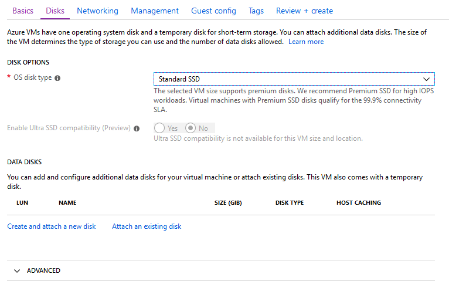
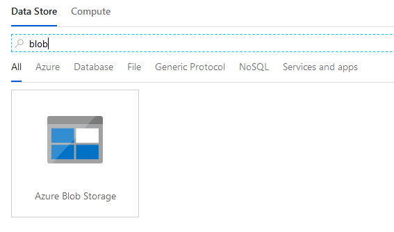
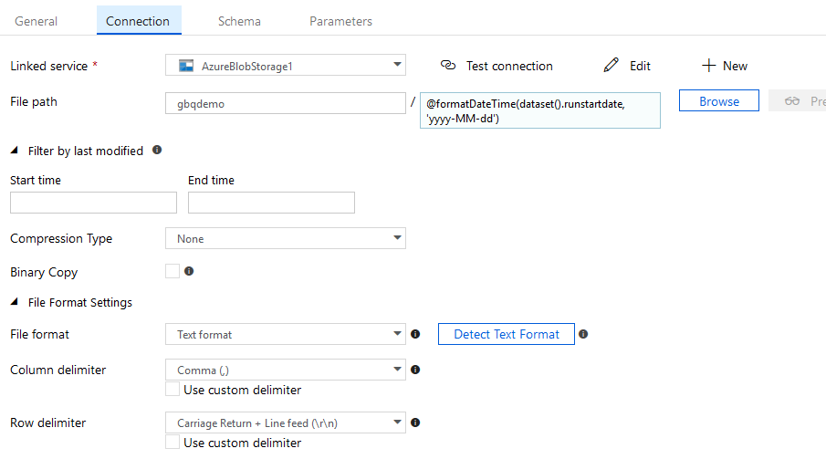

# Google BigQuery Demo
Produced by Dave Lusty
# Introduction
In this demo we’ll configure a Google BigQuery instance, add some data, and then query that data from Azure Data Factory using a copy job. The copy job will use a schedule and only copy data matching certain parameters. You can find the [video demo here](https://www.youtube.com/watch?v=oRqRt7ya_DM)
# Configure Google
## Project Setup
Log into Google Cloud at [https://console.cloud.google.com](https://console.cloud.google.com) and create a new project by clicking the project name on the menu and selecting “new project”.

Name the project “GBQDemo”, a project ID will be created for you. Copy this project ID to your notes for later as we’ll need it to connect from Azure Data Factory.

If you didn’t copy the project ID you can do so later by clicking the ellipsis at the top right of the Google portal and selecting Project Settings.

This will allow you to change the project name and copy the ID and project number if you need to.

## Set up Google BigQuery Tables
Browse to BigQuery in the menu. From here, select your project and click Create Dataset.

Create a dataset with a suitable name, here we’ll use GBQDemo

Next we’ll add tables and fill them with data. For this demo create two columns, one with a datetime stamp and the other a string. This allows us to query based on date for the tumbling window in Azure Data Factory.

Alternatively use the following query from the query editor:
```SQL
CREATE TABLE gbqdemo.testtable (
   name STRING,
   date DATETIME
)
```
To create some data, I used the following query:
```SQL
INSERT gbqdemo.testtable (date, name)
VALUES (datetime(2019, 01, 13, 07, 22, 00), "January 13th 2019"),
(datetime(2018, 12, 21, 05, 45, 00), "December 21st 2018"),
(datetime(2018, 12, 20, 10, 35, 00), "December 20th 2018"),
(datetime(2018, 12, 19, 01, 31, 00), "December 19th 2018"),
(datetime(2018, 12, 18, 02, 32, 00), "December 18th 2018"),
(datetime(2018, 11, 05, 05, 37, 00), "November 5th 2018"),
(datetime(2018, 11, 01, 06, 34, 00), "November 1st 2018")
```
## Create a Query
Use the query editor in BigQuery to create a query for later and test that it returned suitable rows. For this use the following query:
```SQL
SELECT * FROM gbqdemo.testtable WHERE date >= DATETIME "2017-12-01 00:00:00" AND date <= DATETIME "2019-01-01 00:00:00"
```
While not complex, this gives enough information to demo with and will select rows with a timestamp between two values.
## Create a service account
You’ll need some credentials for Azure Data Factory to run under on Google BigQuery.
In the Google portal, browse to the API interface and click Credentials, then Create Credentials and choose Service Account Key.

Create a new account and choose suitable BigQuery roles. Viewer should suffice for read operations. Select a P12 certificate which you’ll need to download and save to the self-hosted integration runtime in Data Factory.

Make a note of the service account ID which looks like an email address, you’ll need this in ADF.
# Configure Azure
## Create Resource Group
Create a resource group to house the demo resources. You’ll need to choose this when creating new resources so that the whole demo is encapsulated and can be deleted as a single item when we’re done.

Create Storage Account
Next, create a new storage account. This will be our “data lake” ingestion storage and will house all incoming data.


Once created, open Storage Explorer and create a container in Blob within the storage account.

This container will house the incoming data from Google BigQuery.
## Create Azure Data Factory
Next, create an empty Azure Data Factory instance for the demo.

## Create Self Hosted Integration Runtime
Create a Windows Server 2016 virtual machine to house the integration runtime. This is needed to allow the Google BigQuery connector to use service accounts. If using personal authentication this server would not be required. 



Here I have enabled RDP access from the public internet for demo convenience. In production you should configure a VPN or Expressroute for security reasons. ** DO NOT DO THIS IN PRODUCTION **
Once this machine is installed, connect to it.
Copy the p12 certificate file you got from Google earlier to the C drive of the system. Create a folder named “keys” to place this in. You’ll need the path for this file when setting up the connector.

Download and install the integration runtime from [https://www.microsoft.com/en-us/download/details.aspx?id=39717](https://www.microsoft.com/en-us/download/details.aspx?id=39717) onto the virtual machine.
Accept all defaults for this tool. 
# Configure Azure Data Factory
## Set up Connections
In Azure Data Factory click the edit button on the left to go to the designer workspace.

Now, click Connections at the bottom of the screen.

### Blob Connector
Under Linked Services, click New.

Type Blob to search and select Azure Blob Storage. Use the drop-down boxes to select your subscription and your storage account. Give the connection a useful name to you can identify it. 

Click to test the connection and if successful click Finish.
### Google BigQuery connector
Click new again and search for Google BigQuery. Fill in your project ID, path to p12 file and account ID. These were created in the “Configure Google” section of this guide. Again, test the connection before clicking finish.

## Set up Datasets
### Blob Output
Now, click datasets in the menu and click new to create a dataset on Blob storage.

Fill in the various pages:

Give the dataset a useful name

Go to the parameters tab and create a parameter called runstartdate of type string. This will be a value passed in from the trigger to name the files.

Now go to the connection tab and select the Blob connector we created before and browse to the container you created earlier. For the file name you’ll need to add dynamic content. This will format the parameter we pass in. You can select the formatDateTime() and the parameter from the list of dynamic content or type them manually.

Finally, go to the Schema tab and create the output schema. This does not have to match the incoming schema. Note here that I am changing the “date” column to “datetime” and formatting it with a datetime format of my choosing.

### Google BigQuery Input
Create another dataset of type Google BigQuery.

Give this a useful name

Under connection choose the Google BigQuery connection we created before. Use the dropdown to select your table. Preview data should now be working.

If preview data returned data, you can use import schema on the schema tab to import the schema. You may need to modify types if they are not detected correctly.
## Set up Pipeline
Now create a new pipeline.

Give it a useful name on the General tab and then add two parameters on the next tab. Here we add runstartdate and runenddate both as string types.
### Create Copy Job
Drag a single Copy Data task onto the designer and give it a name.

Click the copy task to configure it.

Give it a useful name.

Under “Source” select the Google BigQuery dataset we created previously. Add dynamic content for the query since we don’t want the whole table. Use the following query. This will use the parameters we configured in the pipeline as the dates in the query we send to BigQuery. This will return only rows with a date between our start and end times.

```SQL
SELECT * FROM gbqdemo.testtable WHERE date >= DATETIME "@{pipeline().parameters.runstartdate}" AND date <= DATETIME "@{pipeline().parameters.runenddate}"
```


Under sink, select the Blob dataset we created earlier. Because that dataset is expecting a parameter to use for file naming, we pass it in here. Use the following or select it in the dynamic content pane.
```@pipeline().parameters.runstartdate```

Next, map the fields from source to sink. These may already be mapped but always check they are mapped correctly for your job.
## Set up Schedule
Finally, we need to create a trigger. We’ll use a tumbling window type since it gives us individual transfer windows.

In the pipeline view, click trigger at the top of the designer window, then New/Edit.
Create a new trigger here.

Select a start date for the trigger. This can be in the past. The trigger will create one job per “window” so you can start and end at any time and more jobs will be created. Beware that each job will submit one BigQuery request so small windows may add to costs. Each run will also have a cost under Azure.
I selected midnight to midnight with a 24 hour recurrence for simplicity. 
Click Next and you get a parameter screen. Here we use some of the trigger variables to get the start and end datetime for the job and format them for our use. For jobstartdate use:

```@formatDateTime(trigger().outputs.windowStartTime, 'yyyy-MM-dd HH:mm:ss')```

And for jobenddate use:

```@formatDateTime(trigger().outputs.windowEndTime, 'yyyy-MM-dd HH:mm:ss')```

Click finish.
## Publish and run
Click validate all to find any errors you may have made. Once everything is OK click Publish all to submit and save everything. This will save all of the assets you created as well as submit the trigger for evaluation and job creation. If you change anything, you’ll need a new trigger since these are associated with assets behind the scenes so don’t work as a simple scheduler might.
Click the monitor button on the left of the browser window and you’ll see your jobs being queued and run. From here you can see when jobs succeed and when they are running.

### Monitoring
Click the pipe icon under Actions to view the information about the run.

Click the icons under Actions to see more info. These are input, output and details. Input will show you the query after parameters have been used so is useful for troubleshooting. Output shows the details of data transferred and Details shows a visual summary of the job including time taken.


If you look in your blog storage using data explorer you should now see your CSV output files, some of which will contain data.
